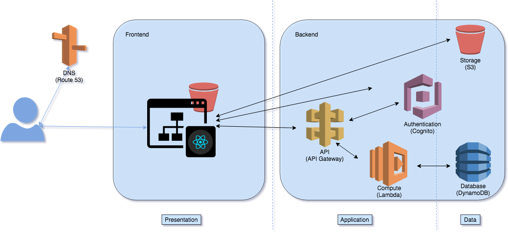

# Basic Website Lab (AWS)
The purpose of this lab is to familiarize yourself with the components of a Serverless website using AWS.
The Project will run through setting up:
- A DynamoDB Table
- Three S3 buckets
- A Cognito User Pool
- A Cognito Identity Pool
- API Gateway

A Basic overview of the architecture:


## Prerequisites
- An AWS User account with an Access Key and Secret Access Key
- AWS CLI
- NodeJS

## Project

### 1. Setting up DynamoDB
1. Navigate to DynamoDB
2. Click on `Tables`
3. Click `Create table`
* Table name:  e.g. my-pool-party-users-bathers
* Primary Key: user_id, String
Use default settings: tick
4. Click `Create`

### 2. Create S3 user Image bucket
1. Navigate to S3
2. Click `Create` bucket
* Bucket Name: e.g. acg-pool-party
* Region: same as lambda
3. Click `Create`
4. Click on the new Bucket
5. Click `Permissions`
6. Click `Bucket policy`
paste the following:
```JSON
{
    "Version": "2012-10-17",
    "Id": "Policy1487688853521",
    "Statement": [
        {
            "Sid": "Stmt1492075309356",
            "Effect": "Allow",
            "Principal": "*",
            "Action": [
                "s3:GetObject",
                "s3:PutObject",
                "s3:PutObjectAcl"
            ],
            "Resource": "arn:aws:s3:::[YOUR BUCKET NAME]/${cognito-identity.amazonaws.com:sub}/*"
        },
        {
            "Sid": "Stmt1487688849187",
            "Effect": "Allow",
            "Principal": "*",
            "Action": "s3:GetObject",
            "Resource": [
                "arn:aws:s3:::[YOUR BUCKET NAME]/public",
                "arn:aws:s3:::[YOUR BUCKET NAME]/public/*"
            ]
        }
    ]
}
```
7. Click on `Save`, then click `CORS Configuration`
paste the following:
```XML
<?xml version="1.0" encoding="UTF-8"?>
<CORSConfiguration xmlns="http://s3.amazonaws.com/doc/2006-03-01/">
<CORSRule>
    <AllowedOrigin>*</AllowedOrigin>
    <AllowedMethod>HEAD</AllowedMethod>
    <AllowedMethod>GET</AllowedMethod>
    <AllowedMethod>PUT</AllowedMethod>
    <AllowedMethod>POST</AllowedMethod>
    <AllowedMethod>DELETE</AllowedMethod>
    <MaxAgeSeconds>3000</MaxAgeSeconds>
    <ExposeHeader>x-amz-server-side-encryption</ExposeHeader>
    <ExposeHeader>x-amz-request-id</ExposeHeader>
    <ExposeHeader>x-amz-id-2</ExposeHeader>
    <AllowedHeader>*</AllowedHeader>
</CORSRule>
</CORSConfiguration>
```
8. Click `Save`


### 3. Please deploy the serverless functions, see [README.MD](./backend/README.MD)


### 4. Setting up API Gateway
1. Navigate to API Gateway
2. Create a new API Gateway and call it 'acg-pool-party'
3. Set endpoint type to `Regional`
5. Create a new resource, click on `Resources` under the api name
5. Click `Actions` -> `Create Resources`
* Resource Name: bathers
* Resource Path: bathers
* Enable API Gateway CORS: tick
6. Click `Create Resource`
7. Click on `Actions` -> `Create Method`
8. Select GET, then click the tick
9. Click on the new GET link
10. Configure:
* Integration type: Lambda Function
* Use Lambda Proxy integration: tick
* Lambda Region: {same region as your lambda function}
* Lambda Function: acg-pool-party-BathersPreference-xxxxxxxxxx
11. Click `Save`
12. Click `OK` to give permission to the lambda function
** Do step 7 to 12 again using a PUT method, and selecting the acg-pool-party-SetBathersPreference-xxxxxxxxxx method

13. `Actions` -> `Deploy API`
* Deployment stage: [New Stage]
* Stage name: dev
14. Click `Deploy`

### 5. Setting up Authentication with Amazon Cognito
1. Navigate to Amazon Cognito
2. Click on Manage user pools
3. Click Create user pool
3. Pool name: pool-party
4. Click Step through settings
6. Make sure username is selected and 'Also allow sign in with verified email address' and 'Also allow sign in with preferred username (a username that your users can change)'
click next step 
** Pro tip, you need to click the button down the bottom or it wont save**
12. Click on policies
13. Tick Allow users to sign themselves up
7. Click on App Clients
8. App client name: react frontend
. untick Generate client secret
9. Untick Enable sign-in API for server-based authentication (ADMIN_NO_SRP_AUTH)
10. Tick Enable username-password (non-SRP) flow for app-based authentication (USER_PASSWORD_AUTH)
11. Save app client changes
14. Click on Triggers
15. Select the auto confirm lambda function in the presignup trigger
click save changes
Click create pool

### 6. Create an identity pool for S3 access
Click on federated identities in 
* Identity pool name: pool_party
* Authentication providers
    * Select Cognito
    * User Pool Id: {paste from config}
    * App client id: {paste from config}
14. Create the identity pool
15. Create a federated identity
16. In authentication providers, click on the cognito tab and fill in the:
    user pool id
    app client id
Click Create Pool
Click Allow
Click Go To Dashboard
Click Edit idenity pool
Copy Identity pool ID

### 7. Setting up Authentication with API Gateway
1. Navigate to API Gateway
2. Click on 'acg-pool-party'
3. Add an authorizer :
* Name: cognito_auth
* Type: Cognito
* Cognito User Pool: pool-party
* Token Source: Authorization
4. Click `Create`
5. Create a new resource
    Resource Name: bathers
    Enable API Gateway CORS: tick
6. Click `create resource`
7. Click on `create new method`
8. Select `GET`, then click the tick
9. Click on `GET`
10. Configure:
    Authorization: cognito_auth
    HTTP Request Headers: Name = Authorization
11. `Action` -> `Deploy API`

### 8. Hosting on S3 (Extra)
1. Navigate to S3
2. Click `Create` bucket
* Bucket Name: acg-pool-party-hosting
* Region: same as lambda
3. Click `Create`
4. Click on the new Bucket
5. Click `Permissions`
6. Click `Bucket policy`
paste the following:
```JSON
{
    "Version": "2008-10-17",
    "Statement": [
        {
            "Effect": "Allow",
            "Principal": "*",
            "Action": "s3:GetObject",
            "Resource": "arn:aws:s3:::[YOUR BUCKET NAME]/*"
        }
    ]
}
```
7. Click on `Save`, then click `Access Control List`
8. Click on Everyone under Public Access, Tick List objects then click Save
9. Click on Properties
10. Click on Static website hosting
11. Tick Use this bucket to host a website, click save
12. Navigate to the frontend directory in a terminal
13. type `aws s3 sync --acl 'public-read' --delete ./ "s3://[YOUR BUCKET NAME]/" --profile [YOUR PROFILE NAME]`